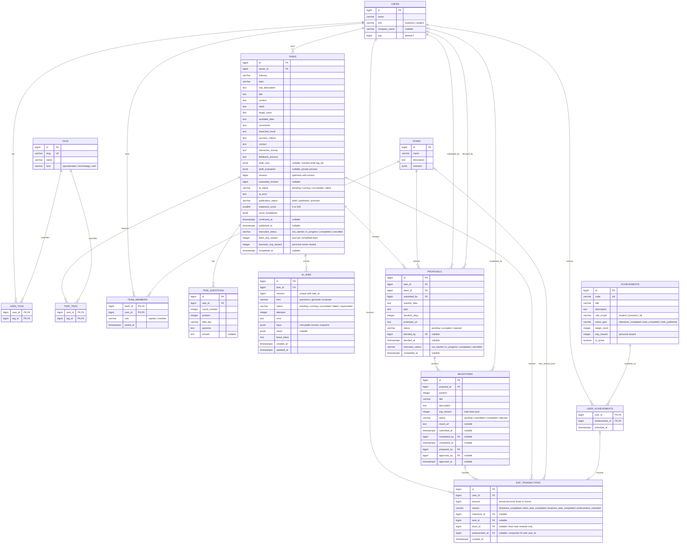

```mermaid
erDiagram
    USERS ||--o{ USER_TAGS : has
    TAGS ||--o{ USER_TAGS : classifies

    TASKS ||--o{ TASK_TAGS : requires
    TAGS ||--o{ TASK_TAGS : classifies

    USERS ||--o{ TEAM_MEMBERS : joins
    TEAMS ||--o{ TEAM_MEMBERS : includes

    USERS ||--o{ TASKS : owns
    TASKS ||--o{ TASK_QUESTIONS : has
    TASKS ||--o{ AI_JOBS : checks

    TASKS ||--o{ PROPOSALS : receives
    TEAMS ||--o{ PROPOSALS : submits
    USERS ||--o{ PROPOSALS : submitted_by
    USERS o|--o{ PROPOSALS : decided_by

    PROPOSALS ||--o{ MILESTONES : contains
    USERS o|--o{ MILESTONES : completed_by

    USERS ||--o{ USER_ACHIEVEMENTS : unlocks
    ACHIEVEMENTS ||--o{ USER_ACHIEVEMENTS : awarded_as

    USERS ||--o{ EXP_TRANSACTIONS : receives
    MILESTONES o|--o{ EXP_TRANSACTIONS : rewards
    TASKS o|--o{ EXP_TRANSACTIONS : rewards
    TEAMS o|--o{ EXP_TRANSACTIONS : task_reward_pool
    USER_ACHIEVEMENTS o|--o| EXP_TRANSACTIONS : rewards

    USERS {
        bigint id PK
        varchar name
        varchar role "business | student"
        varchar company_name "nullable"
        bigint exp "default 0"
    }

    TAGS {
        bigint id PK
        varchar slug UK
        varchar name
        varchar kind "specialization | technology | skill"
    }

    USER_TAGS {
        bigint user_id PK, FK
        bigint tag_id PK, FK
    }

    TASK_TAGS {
        bigint task_id PK, FK
        bigint tag_id PK, FK
    }

    TEAMS {
        bigint id PK
        varchar name
        text description
        jsonb interests
    }

    TEAM_MEMBERS {
        bigint team_id PK, FK
        bigint user_id PK, FK
        varchar role "captain | member"
        timestamptz joined_at
    }

    TASKS {
        bigint id PK
        bigint owner_id FK
        varchar industry
        varchar topic

        text raw_description
        text title
        text context
        text need
        text target_users
        text available_data
        text constraints
        text expected_result
        text success_criteria
        text contact
        text interaction_format
        text feedback_process

        jsonb draft_card "nullable, includes draft tag_ids"
        jsonb draft_evaluation "nullable, private preview"
        bigint revision "optimistic edit version"
        bigint evaluated_revision "nullable"
        varchar ai_status "pending | running | succeeded | failed"
        text ai_error
        varchar publication_status "draft | published | archived"
        smallint readiness_score "0 to 100"
        jsonb score_breakdown
        timestamptz confirmed_at "nullable"
        timestamptz published_at "nullable"

        varchar execution_status "not_started | in_progress | completed | cancelled"
        integer team_exp_reward "pool per completed team"
        integer business_exp_reward "personal owner reward"
        timestamptz completed_at "nullable"
    }

    TASK_QUESTIONS {
        bigint id PK
        bigint task_id FK
        integer round_number
        integer position
        varchar field_key
        text question
        text answer "nullable"
    }

    AI_JOBS {
        bigint id PK
        bigint task_id FK
        bigint revision "unique with task_id"
        varchar kind "questions | generate | evaluate"
        varchar status "pending | running | succeeded | failed | superseded"
        integer attempts
        text error
        jsonb input "immutable revision snapshot"
        jsonb result "nullable"
        text lease_token
        timestamptz created_at
        timestamptz updated_at
    }

    PROPOSALS {
        bigint id PK
        bigint task_id FK
        bigint team_id FK
        bigint submitted_by FK

        text solution_idea
        text plan
        integer duration_days
        text prototype_url

        varchar status "pending | accepted | rejected"
        bigint decided_by FK "nullable"
        timestamptz decided_at "nullable"

        varchar execution_status "not_started | in_progress | completed | cancelled"
        timestamptz completed_at "nullable"
    }

    MILESTONES {
        bigint id PK
        bigint proposal_id FK
        integer position
        varchar title
        text description

        integer exp_reward "total team pool"
        varchar status "pending | submitted | completed | rejected"
        text result_url "nullable"
        timestamptz submitted_at "nullable"
        bigint completed_by FK "nullable"
        timestamptz completed_at "nullable"
        bigint proposed_by FK
        bigint approved_by FK "nullable"
        timestamptz approved_at "nullable"
    }

    ACHIEVEMENTS {
        bigint id PK
        varchar code UK
        varchar title
        text description
        varchar role_scope "student | business | all"
        varchar event_type "milestone_completed | task_completed | task_published"
        integer target_count
        integer exp_reward "personal reward"
        boolean is_active
    }

    USER_ACHIEVEMENTS {
        bigint user_id PK, FK
        bigint achievement_id PK, FK
        timestamptz unlocked_at
    }

    EXP_TRANSACTIONS {
        bigint id PK
        bigint user_id FK
        bigint amount "actual personal share or bonus"
        varchar reason "milestone_completed | team_task_completed | business_task_completed | achievement_unlocked"

        bigint milestone_id FK "nullable"
        bigint task_id FK "nullable"
        bigint team_id FK "nullable, team task rewards only"
        bigint achievement_id FK "nullable, composite FK with user_id"

        timestamptz created_at
    }
```
