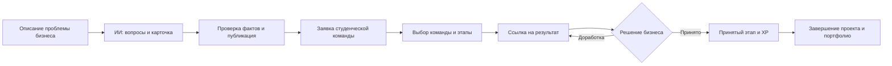
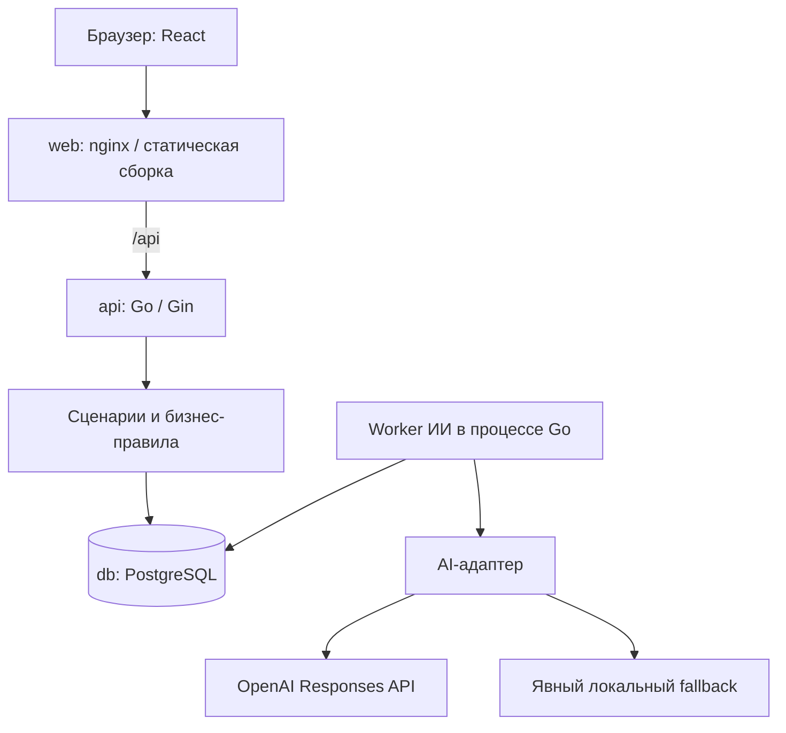

# Larda — от бизнес-проблемы к подтверждённому опыту

**Платформа для хакатона AI Sana / HackAlem, которая соединяет задачи малого и среднего бизнеса со студенческими командами.** ИИ помогает подготовить понятную постановку задачи, бизнес контролирует выполнение и принимает результат, а студенты накапливают опыт и портфолио выполненных командных проектов.

Проект — работающий MVP на React, Go и PostgreSQL. Основной сценарий проходит через настоящий API и базу данных. Вход демонстрационный: пользователь выбирает профиль бизнеса, капитана или участника команды.

## 1. Проблема и аудитория

Бизнесу нужно превратить практическую проблему в задачу с понятным результатом: описать контекст, доступные данные, ограничения и критерии приёмки. Студентам нужны прикладные проекты, в которых можно предложить решение, показать результат и получить подтверждение выполненной работы.

Larda объединяет эти действия в одном процессе:

- **Для бизнеса:** подготовка задачи с помощью ИИ, предложения команд, согласованные этапы и ручная приёмка.
- **Для студентов:** каталог задач, подача командной заявки, сдача результата по ссылке, XP, достижения и завершённые проекты.
- **Для демонстрации на хакатоне:** смена ролей позволяет показать весь цикл в одном браузере.

## 2. Что реализовано

### Кабинет бизнеса

- Отдельные разделы «Рабочий стол», «Мои задачи», «Отклики и проекты».
- Пошаговое создание задачи: описание → уточняющие вопросы → проверка карточки → публикация.
- Асинхронная обработка ИИ: генерация вопросов, подготовка карточки, оценка готовности. Ошибку можно увидеть и повторить обработку явно.
- Редактирование и подтверждение версии карточки. Черновик не попадает в публичный каталог; опубликованные изменения становятся публичными после подтверждения.
- Рассмотрение заявок, выбор и отклонение команд.
- Добавление этапов с описанием результата и наградой, принятие результата или возврат на доработку.
- Очередь результатов на проверке и новых заявок; отдельное завершение работы команды и всей задачи.

### Кабинет студента

- Каталог с поиском и фильтрами, включая готовность и открытые для заявок задачи.
- Подача заявки **капитаном команды**: идея решения, план, срок в днях и необязательная ссылка на прототип.
- Пошаговая форма с кнопкой «Назад» и сохранением ввода между шагами.
- Просмотр заявок, проектов и согласованных этапов; отправка HTTP(S)-ссылки на результат, повторная сдача после доработки.
- «Мой прогресс»: уровень по серверному XP, достижения, навыки профиля и завершённые проекты со ссылками на принятые результаты.

### Общие возможности

- Единый адаптивный светлый интерфейс, клавиатурная навигация и поддержка reduced motion.
- Данные сохраняются в PostgreSQL; профиль, раздел и задача отражаются в URL.
- Сервер проверяет роли, владение задачей, членство команды и допустимые переходы состояний.
- Принятие результата и начисление опыта выполняются транзакционно; повторная приёмка не выдаёт награду дважды.
- Низкая готовность карточки не блокирует публикацию или заявку. Готовность постановки и прогресс исполнения — разные показатели.

**Правила серверного MVP:** принятие заявки начинает работу команды; на задачу допустимы несколько команд, число этапов произвольное. Награда этапа делится между текущими участниками команды. Дополнительные награды и достижения определяются backend. Интерфейс не начисляет XP самостоятельно.

## 3. Как работает решение



ИИ помогает подготовить постановку. **Факты подтверждает бизнес; выбор команды и приёмку также выполняет человек.** Ссылка на результат и запись о принятии связывают работу команды с её профессиональным опытом. Подтверждение в MVP — действие выбранного демопрофиля бизнеса, а не внешняя проверка компании.

## 4. Технологии

| Компонент | Используемые технологии |
| --- | --- |
| Frontend | TypeScript, React 19, React Router 7, Vite 8, CSS |
| Backend | Go 1.26.8, Gin, GORM, PostgreSQL-драйвер pgx |
| Хранение | PostgreSQL 16, SQL-миграции, транзакции |
| ИИ | OpenAI Responses API, строгие JSON-схемы Structured Outputs, серверная проверка ответа |
| Контейнеризация | Docker Compose, многоэтапные Dockerfile, nginx 1.28; Node.js 22 для сборки frontend |
| Проверки | Playwright, Go testing, интеграционные тесты PostgreSQL, go vet |

Версии frontend-зависимостей зафиксированы в [package-lock.json](package-lock.json), backend — в [go.mod](go.mod) и [go.sum](go.sum).

### Модель и режимы ИИ

Модель задаётся через `OPENAI_MODEL`, адрес API — через `OPENAI_BASE_URL`. В текущем `.env.example` указано `gpt-6-luna`; значение по умолчанию в Go/Compose при отсутствии настройки — `gpt-4o-mini`. Это параметры конфигурации: для внешнего запуска необходимо указать модель, доступную вашему API-ключу и поддерживающую используемый формат ответа.

- `AI_MODE=openai` — backend вызывает внешний API. Нужны ключ и доступ к сети.
- `AI_MODE=fallback` — явный локальный помощник без обращения к модели: детерминированные вопросы, подготовка карточки и проверка заполненности. Он обозначен как демо-режим.

Ошибка OpenAI **не переключает** систему в fallback автоматически. `/api/v1/runtime` показывает настроенный режим; источник конкретной оценки сохраняется в задаче. Старый источник `fallback` не меняется только от перезапуска сервера.

## 5. Архитектура



API сохраняет запрос на обработку в БД и возвращает управление браузеру. Worker обрабатывает AI-задание, сохраняет результат и статус; frontend опрашивает сервер. Отдельные Redis, брокер сообщений или сервис ИИ для этого не требуются.

| Путь | Назначение |
| --- | --- |
| `src/features/connected/` | Основные серверные экраны, пошаговые формы, сдача и приёмка этапов |
| `src/data/` | HTTP-клиент, загрузка серверных данных и отдельный локальный репозиторий |
| `src/shared/` | Общие контролы и компоненты анимации |
| `src/app/`, `src/domain/` | Маршруты и правила сохранённого локального демо; часть общих вычислений |
| `cmd/api/` | Запуск API, подключение БД, миграции, seed и worker |
| `internal/application/`, `internal/domain/` | Серверные сценарии и бизнес-правила |
| `internal/ports/`, `internal/adapters/` | Контракты, HTTP, PostgreSQL и AI-адаптеры |
| `migrations/` | SQL-миграции схемы |
| `tests/` | Frontend-, контрактные и сквозные проверки |
| `docs/openapi.yaml` | Контракт REST API |

В разработке Vite проксирует `/api` на backend. В Compose эту роль выполняет nginx. Ключ модели хранится на backend и не включается в frontend-сборку.

## 6. Установка и запуск

### Через Docker Compose — основной способ для жюри

Нужны Git, Docker Engine или Docker Desktop с Compose и свободные порты. Команды ниже выполняются в Bash/Zsh из корня полученной копии репозитория; Node.js и Go на хосте не требуются.

**1. Создайте конфигурацию, если её ещё нет:**

Конфигурацию создавать не нужно для удобства тестирования залит env с действующим api ключом

**2. Выберите режим в `.env`:**

Для воспроизводимой демонстрации без ключа и внешних запросов:

```dotenv
AI_MODE=fallback
SEED_DEMO=true
```

Для проверки внешнего ИИ задайте `AI_MODE=openai`, свой `OPENAI_API_KEY` и доступный `OPENAI_MODEL`. Не публикуйте `.env` и не помещайте ключ в переменные `VITE_*`.

**3. Соберите и запустите весь стек:**

```bash
WEB_PORT=3001 HTTP_PORT=8081 POSTGRES_PORT=5433 \
  docker compose up --build --force-recreate -d --wait
```

Если на Linux доступ к Docker socket требует `sudo`, используйте вместо предыдущей команды:

```bash
sudo env WEB_PORT=3001 HTTP_PORT=8081 POSTGRES_PORT=5433 \
  docker compose up --build --force-recreate -d --wait
```

Эти порты выбраны для отделения от локальных запусков на 3000/8080. Используйте те же значения при следующем `up` либо сохраните их в `.env`. Compose поднимает PostgreSQL, применяет миграции, заполняет пустую БД демонстрационными данными и запускает API и frontend.

**4. Откройте [http://127.0.0.1:3001](http://127.0.0.1:3001).** Отдельный `npm run dev` для Docker не нужен.

**5. Проверьте состояние:**

```bash
docker compose ps
curl http://127.0.0.1:3001/healthz
curl http://127.0.0.1:3001/api/v1/runtime
```

Ожидается `{"status":"ok"}` и выбранный `ai_mode`. У `db`, `api`, `web` предусмотрены healthcheck. Успешный healthcheck не доказывает успешность запроса к модели: дождитесь вопросов и карточки в пользовательском сценарии.

При ошибке:

```bash
docker compose logs --tail=100 api web
```

Для остановки с сохранением данных:

```bash
docker compose stop
```

Если требуется, добавляйте `sudo` к Docker-командам; `curl` его не требует. Не используйте `down -v`, если нужно сохранить БД.

**CORS:** Compose автоматически разрешает `localhost` и `127.0.0.1` своего `WEB_PORT`, а также Vite на 5173. Для другого домена задайте точный origin в `CORS_ORIGINS`. После изменения конфигурации пересоздайте контейнеры; простой `restart` не применяет новые переменные.

### Разработка frontend

При уже запущенном Docker API на 8081 установите Node.js 22 и выполните:

```bash
npm ci
API_PROXY_TARGET=http://127.0.0.1:8081 npm run dev
```

Откройте адрес из вывода Vite, обычно http://localhost:5173. Сборка: `npm run build`. Запуск Go вне Docker требует версии из `go.mod`, доступной PostgreSQL и настроенного `DATABASE_URL`: [подробная инструкция](docs/RUN_INTEGRATED.md).

## 7. Как проверить решение: сценарий для жюри

После первого запуска с `SEED_DEMO=true` доступны профили **«Бизнес»**, **«Капитан»** и **«Студент»**. Выбирайте их в верхней части страницы. Для заявки и сдачи результата нужен именно капитан.

### Пример: учёт списаний в кофейне

1. **Бизнес:** нажмите «Создать задачу» и введите:

   > Учебный пример: небольшая кофейня ведёт остатки молока в таблице и хочет видеть причины списаний. Нужен веб-прототип с вводом списания и недельным отчётом. Для демонстрации используем обезличенные тестовые данные.

2. Дождитесь уточнений и ответьте на каждый вопрос. Можно использовать учебные условия: пользователи — менеджеры; данные — тестовая CSV-таблица; результат — прототип; критерий — запись списания появляется в недельном отчёте; срок — две недели; обратная связь — демонстрация после этапа. Если сведений нет, укажите, что их нужно уточнить. Проверьте работу «Назад».
3. Нажмите «Подготовить карточку». Проверьте текст, при необходимости сохраните правки и дождитесь оценки. Отметьте «Я проверил факты в карточке», подтвердите и отдельно опубликуйте задачу.
4. **Капитан:** найдите задачу в каталоге, нажмите «Подать заявку», выберите команду. Идея: «Веб-прототип учёта списаний». План: «Изучить CSV, сделать форму ввода, добавить недельный отчёт». Срок: 7 дней. Проверьте и отправьте заявку.
5. **Бизнес:** откройте «Заявки и результаты», выберите команду. Нажмите «Добавить этап»: название — «Рабочий прототип»; критерий — «Запись списания отображается в отчёте за неделю». Сохраните этап.
6. **Капитан:** во вкладке «Моя команда» нажмите «Сдать этап» и укажите HTTP(S)-ссылку на подготовленный репозиторий, прототип или демонстрационный материал.
7. **Бизнес:** сначала верните результат на доработку. **Капитан:** исправьте результат и отправьте ссылку повторно. **Бизнес:** примите результат, завершите работу команды и подтвердите завершение всей задачи.
8. **Капитан:** откройте «Мой прогресс». Проверьте XP, завершённый проект и ссылку на принятый результат. Обновите страницу: сохранённые записи остаются в БД.

Ожидаемый результат: опубликованная задача, сохранённая заявка, принятый этап, завершённый проект и серверный опыт команды. Заявка и возвращённый на доработку результат сами по себе не начисляют студенческий XP. Итоговое число баллов зависит от награды этапа, состава команды и уже открытых достижений.

Для быстрого показа без подготовки новой карточки можно открыть одну из начальных опубликованных задач и продолжить с заявками. Начальные записи — синтетические и не подтверждают наличие реального заказчика.

### Автоматические проверки

```bash
npm ci
npx playwright install chromium
npm run build
npm run test:e2e
go test ./...
go vet ./...
```

`test:e2e` покрывает локальные правила и браузерные сценарии, включая HTTP-подмены. Для Go-команд нужен Go из `go.mod`; PostgreSQL integration tests требуют отдельного `TEST_DATABASE_URL`.

Сквозной тест с настоящей БД и API запускается отдельно:

```bash
API_PROXY_TARGET=http://127.0.0.1:8180 npm run test:live
```

Перед этим нужен отдельный тестовый API на 8180 с `AI_MODE=fallback`, своей БД и разрешённым origin `http://127.0.0.1:4175`. Команда сама API не запускает и создаёт тестовые записи. Не подключайте fallback-worker к БД работающего OpenAI-worker: они читают общую очередь. Оба набора Playwright используют порт 4175, поэтому запускаются последовательно. История фактических проверок — в [progress.md](progress.md).

## 8. Данные и интеграции

| Источник | Что используется |
| --- | --- |
| Ввод бизнеса | Описание проблемы, ответы, подтверждённые условия и решения о приёмке |
| Ввод команды | Идея, план, срок и ссылки на результаты |
| PostgreSQL | Пользователи, команды, задачи, заявки, этапы, AI-задания, XP и достижения |
| OpenAI Responses API | Обработка постановки задачи при `AI_MODE=openai`; описание и ответы передаются настроенному провайдеру |
| Seed | Три демопрофиля, пять команд, пять опубликованных задач с заявками и пять приватных примерных черновиков |
| Внешние ссылки | Артефакты работы; платформа сохраняет URL, а не загружает и не анализирует содержимое файлов |

Seed заполняет пустую пользовательскую БД один раз. Оба студента входят во все пять демонстрационных команд. Примерные черновики не запускают платные AI-задания автоматически: для них предусмотрен явный повтор обработки.

REST API описан в [OpenAPI](docs/openapi.yaml). Полученные Postman-файлы находятся в [docs/from backend](docs/from%20backend/). Интеграции с CRM, LMS, платёжными системами и автоматический импорт реальных бизнес-задач в текущем сценарии не реализованы.

## 9. Ограничения текущей версии

- **Нет полноценной аутентификации:** `X-Demo-User-ID` выбирает профиль. Проверки ролей существуют, но переключатель не подтверждает личность пользователя или компании.
- **Начальные данные синтетические.** Приёмка означает запись решения демопрофиля бизнеса, а не независимый аудит результата.
- **Командная награда:** сервер не хранит подтверждённый личный вклад каждого студента. Навыки профиля не равны верифицированному владению навыком.
- **Расширенные RPG-правила отделены:** ранги E–S, фиксированные три этапа, сроки, версии сдачи и персональная атрибуция есть в локальном демо, но не представлены как возможности основного серверного интерфейса.
- **Ограниченный UI:** нет экранов управления составом команд, загрузки файлов, чата, полноценных уведомлений и управления отменой проектов. Наличие отдельных операций API не означает наличие соответствующего экрана.
- **Нет полноценных истории версий результата и комментария при доработке в серверном сценарии:** сдаётся ссылка, решение о приёмке — принять или вернуть.
- Каталог в текущем frontend загружает до 100 задач. Несохранённый ввод может потеряться при refresh или уходе в другой раздел.
- ИИ не гарантирует достоверность формулировок или бизнес-эффект. Нужна проверка человеком; доступность внешней модели зависит от настроек, ключа и сети.
- Метрики надёжности, численные уровни навыков, публичный рейтинг участников и финансовый эффект не заявлены как реализованные.

### Отдельное локальное демо

```bash
npm ci
npm run dev:local
```

Этот режим работает через `sessionStorage`, без backend и внешнего ИИ. Он демонстрирует расширенную геймификацию; его записи и правила не синхронизируются с PostgreSQL. При ошибке серверного API приложение не переключается на него автоматически. Подробности: [правила геймификации](docs/GAMIFICATION.md).

## 10. Развёрнутая версия и документация

**Публичный адрес deployed-версии в текущем репозитории не указан.** Адрес http://127.0.0.1:3001 доступен только на машине, где выполнен Docker-запуск выше, и не является публичной ссылкой для жюри.

- [Docker: запуск, CORS и диагностика](docs/DOCKER_QUICKSTART.md)
- [Подключение ИИ и интерпретация fallback](docs/AI_CONNECTION.md)
- [Разработка и интеграционные проверки](docs/RUN_INTEGRATED.md)
- [Backend](BACKEND.md) и [REST-контракт](docs/openapi.yaml)
- [Архитектурные решения](contextn.md) и [журнал проверок](progress.md)
